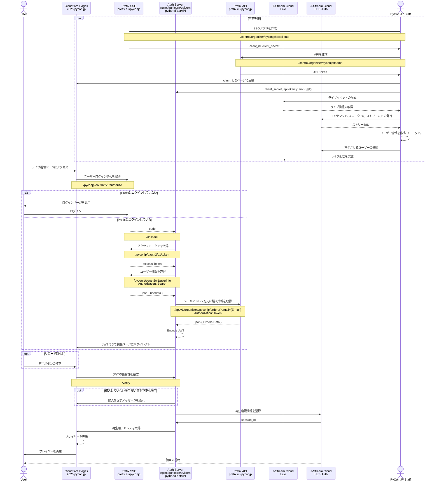

# key_ticket_system
Secure HLS System

## Build and Install (Almalinux 10)
### Fast API
```
$ sudo dnf -y update
$ sudo dnf -y groupinstall "Development Tools"
$ sudo dnf -y install policycoreutils-python-utils bzip2-devel.x86_64 ncurses-devel.x86_64 libffi-devel.x86_64 readline-devel.x86_64 sqlite-devel.x86_64

$ git clone https://github.com/pyenv/pyenv.git ~/.pyenv
$ echo 'export PYENV_ROOT="$HOME/.pyenv"' >> ~/.bashrc
$ echo '[[ -d $PYENV_ROOT/bin ]] && export PATH="$PYENV_ROOT/bin:$PATH"' >> ~/.bashrc
$ echo 'eval "$(pyenv init - bash)"' >> ~/.bashrc

$ echo 'export PYENV_ROOT="$HOME/.pyenv"' >> ~/.bash_profile
$ echo '[[ -d $PYENV_ROOT/bin ]] && export PATH="$PYENV_ROOT/bin:$PATH"' >> ~/.bash_profile
$ echo 'eval "$(pyenv init - bash)"' >> ~/.bash_profile

$ source .bashrc

$ pyenv install 3.13.7
$ pyenv global 3.13.7

$ git clone https://github.com/takashi74/key_ticket_system
$ ln -s key_ticket_system pyconjp
$ cd pyconjp

$ sudo cp infra/pyconjp-ticket.service /etc/systemd/system/

$ python -m venv .venv
$ source .venv/bin/activate
(.venv) $ pip install -U pip
(.venv) $ pip install -r requirements.txt
(.venv) $ cp app/.env.sample app/.env
(.venv) $ vi app/.env
(.venv) $ deactivate

# (selinux todo)

$ sudo systemctl daemon-reload
$ sudo systemctl enable pyconjp-ticket.service
$ sudo systemctl start pyconjp-ticket.service
```

## Sequence Diagram
### Live Stream Playing
